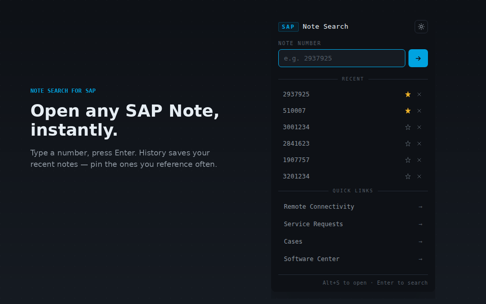

# Note Search for SAP

A minimal browser extension for quickly opening SAP Notes by number. Search from the toolbar, right-click any highlighted number, or press `Alt+S` — jumps straight to the note in SAP for Me.

Available for **Chrome** and **Firefox**.



## Features

- **Popup search** — type a note number, press Enter, open it
- **Right-click context menu** — highlight a note number on any page → open it directly
- **Keyboard shortcut** — `Alt+S` opens the popup with the input focused
- **Search history with pinning** — recent notes are saved; star ones you reference often
- **Light / dark theme** — toggle in the header, preference is remembered
- **Quick links** — Service Requests, Cases, Software Center
- **Smart number parsing** — accepts pasted numbers with whitespace (`" 2 937 925 "`), embedded numbers (`see SAP Note 2937925`), and leading zeros (`0002937925`)

## Install

### Chrome (from the Chrome Web Store)

*Once the extension is published, the install link will appear here.*

<!-- **[Install from the Chrome Web Store →](https://chromewebstore.google.com/detail/<extension-id>)** -->

### Firefox

Firefox users can install from a built zip — see the [Local Development](#local-development) section below to build one, or grab a pre-built zip from the [Releases](../../releases) page (when available).

### Manual install (either browser)

1. Clone or download this repo
2. Run `python3 build.py` to produce browser packages in `dist/`
3. **Chrome:** open `chrome://extensions`, enable Developer mode, click "Load unpacked", select the `src/` folder
4. **Firefox:** open `about:debugging#/runtime/this-firefox`, click "Load Temporary Add-on…", select `dist/note-search-for-sap-firefox.zip`

## Usage

**From the toolbar (or `Alt+S`):**
- Type a note number (e.g. `2937925`), press **Enter**
- A new tab opens at `https://me.sap.com/notes/<number>`

**From any web page:**
- Highlight a note number (or text containing one)
- Right-click → **Open as SAP Note: "..."**

**History:**
- Recent notes appear under "recent" in the popup
- Click a row to reopen the note
- Click the star to pin (pinned notes stick to the top, never auto-trimmed)
- Click the × to remove an entry
- Up to 25 unpinned entries are kept; pinned ones are unlimited

You'll need an active S-user session for SAP for Me to view notes.

## Privacy

Note Search for SAP does not collect, transmit, or share any personal data. No analytics, no telemetry, no third-party requests. All extension data (theme preference, search history) is stored locally in your browser.

See [PRIVACY_POLICY.md](PRIVACY_POLICY.md) for the full policy.

## Local development

```bash
# Clone the repo
git clone https://github.com/pearl-bst/note-search-for-sap.git
cd note-search-for-sap

# Build both browser packages
python3 build.py
# → dist/note-search-for-sap-chrome.zip
# → dist/note-search-for-sap-firefox.zip

# For active development in Chrome, load src/ directly as an unpacked extension:
#   chrome://extensions → Developer mode → Load unpacked → select src/
# Changes to src/ are picked up when you click the reload icon on the extension card.
```

## Project structure

```
note-search-for-sap/
├── src/                    ← Extension source
│   ├── manifest.json       ← Chrome-shaped MV3 manifest
│   ├── popup.html          ← Popup UI
│   ├── popup.css           ← Styling (light/dark theme)
│   ├── popup.js            ← Popup logic
│   ├── background.js       ← Service worker (context menu)
│   └── icons/              ← 16 / 48 / 128 px PNG icons
├── build.py                ← Builds Chrome + Firefox packages into dist/
├── dist/                   ← Build output (git-ignored)
├── docs/                   ← README assets
├── LICENSE                 ← MIT
├── PRIVACY_POLICY.md
├── CONTRIBUTING.md
└── README.md
```

## Contributing

Contributions and bug reports are welcome. See [CONTRIBUTING.md](CONTRIBUTING.md).

## Disclaimer

This extension is an independent tool. It is not affiliated with, endorsed by, or sponsored by SAP SE. "SAP" and "SAP for Me" are trademarks of SAP SE.

## License

[MIT](LICENSE)
